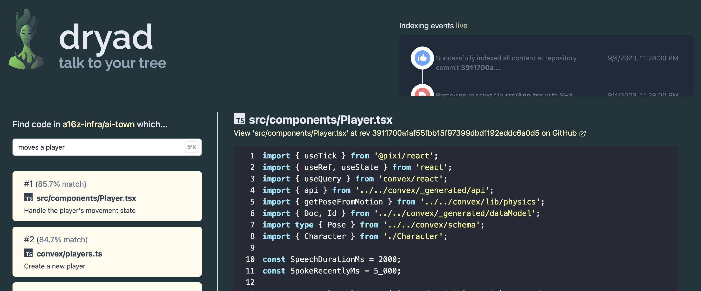
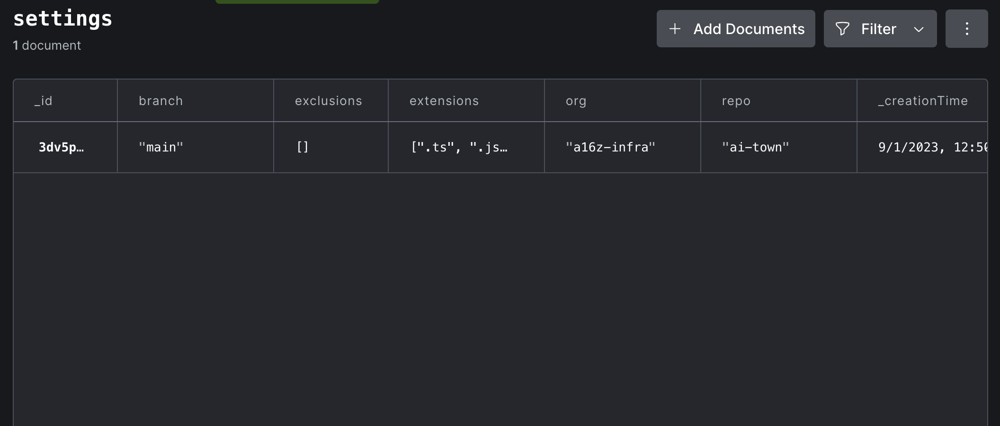

# dryad



Dryad talks to you trees! Easy semantic code search on any GitHub repository.

Dryad is intended to be a useful demo project and starter template for building more sophisticated
semantic search web apps.

Features:

- Automatically tracks changes in the target repo and keeps the search index in sync with `HEAD`
- Built with [Convex](https://convex.dev), [OpenAI](https://openai.com),
  [Vite](https://vitejs.dev/) + [React](https://react.dev/).
- Around 1000 lines of code. Easy to read, fork, and modify.
- Reconfigurable on the fly using the Convex dashboard

# Running your own Dryad (on your favorite codebase)

First, clone the repository and start it up:

    $ git clone https://github.com/get-convex/dryad.git
    $ npm run dev

This will create your Convex backend deployment, which will
attempt to start indexing the default repository (https://github.com/get-convex/convex-demos).

Launch the Convex dashboard and watch the logs to follow along:

    $ npx convex dashboard

In the `Logs` panel, you'll see errors about missing environment variables.
We have a little more set up to do!

## 1. Set deployment environment variables for OpenAI and GitHub

### OpenAI

Dryad uses OpenAI for summarization and embedding. You'll need an OpenAI platform account
and an API key. Visit [platform.openai.com](https://platform.openai.com) to
take care of that.

> :warning: \*\*Summarizing and indexing even a moderate codebase consumes a fair amount of OpenAI
> credits. You will almost certainly need a paid account!

### GitHub

Anonymous uses of the GitHub API get rate limited very easily. So Dryad require that you
generate a personal access token using your GitHub account. Visit
[https://github.com/settings/tokens](https://github.com/settings/tokens) to generate
a token for Dryad.

### Setting these environment variables in your Convex deployment

With your OpenAI API key and GitHub access token in hand, go back to your
Convex deployment's dashboard. In the left navigation panel, click "Settings",
and then "Environment Variables".

Name the two secret environment variables `OPENAI_API_KEY` and `GITHUB_ACCESS_TOKEN`, like so:


## 2. Customize your dryad settings in the `settings` table

If you check the `Logs` view in your Convex dashboard, Dryad now should
be running successfully! But it's indexing the default repository,
`get-convex/convex-helpers`. You probably want it indexing your own
code instead.

Good news! It's easy to customize dryad's behavior. Dryad keeps all
its configuration in a `settings` table in your Convex database
itself. Click on the `Data` view in the dashboard, and then choose
the `settings` table:



The, schema of this table can be found in `convex/schema.ts` in this repository.
Here's what it looks like:

```tsx
  // Various project settings you can tweak in the dashboard as we go.
  settings: defineTable({
    org: v.string(),
    repo: v.string(),
    branch: v.string(),
    extensions: v.array(v.string()),
    exclusions: v.optional(v.array(v.string())),
    byteLimit: v.optional(v.number()),
    chatModel: v.optional(v.string()),
  }),
```

### Settings fields

- **org** - The organization owner of the target GitHub repo to index. For React (https://github.com/facebook/react), this is `facebook`.
- **repo** - The repository name of the target GitHub repo to index. For React (https://github.com/facebook/react), this is `react`. (This can be private as long as your personal access token has permissions to read it.)
- **branch** - The the branch name in the repository to index. This is usually 'main', or 'master.
- **extensions** - An array of file extensions (like '.ts') that should be considered code and therefore Dryad should attempt to index.
- **exclusions** - An array of relative file paths with the repository you wish to explicitly skip indexing.
- **byteLimit** - Do not index files larger than this byte count. Large files will produce more tokens
  that the OpenAI model is able to process in one pass.
- **chatModel** - Which OpenAI chat model to use for summarizing the purposes of source files. Typical choices are `gpt-3.5-turbo`, `gpt-4`.

# How Dryad works

# "Homework" – Candidate improvements to the project
