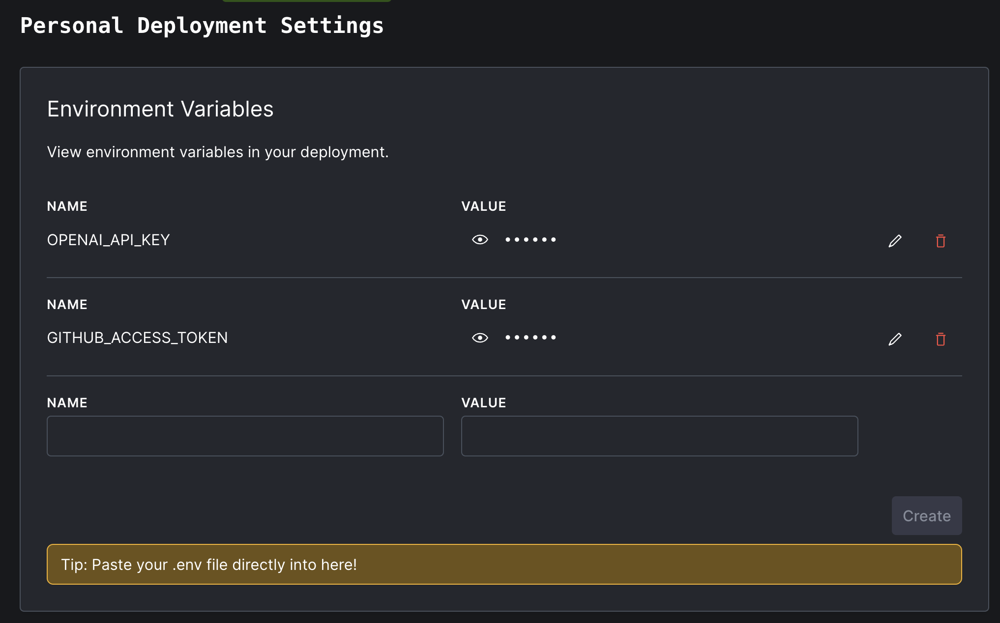

# dryad - talk to your tree

Easy semantic code search on any GitHub repository in ~1000 SLOC.

[Check out the running demo](http://convex.dev/dryad)


Dryad is intended to be a useful demo project and starter template for building more sophisticated
semantic search web apps.

Features:

- Automatically tracks changes in the target repo and keeps the search index in sync with `HEAD`
- Built with [Convex](https://convex.dev), [OpenAI](https://openai.com),
  [Vite](https://vitejs.dev/) + [React](https://react.dev/).
- Easy to read, fork, and modify.
- Reconfigurable on the fly using the Convex dashboard

# Running your own dryad (on your favorite codebase)

First, clone the repository and start it up:

    $ git clone https://github.com/get-convex/dryad.git
    $ npm i
    $ npm run dev

This will create your Convex backend deployment, which will
attempt to start indexing the default repository (https://github.com/get-convex/convex-helpers).
Then, the frontend will start up, running on vite's usual port 5173.

In another terminal in this same repository, launch the Convex dashboard and watch the logs to
follow along with backend indexing:

    $ npx convex dashboard

In the `Logs` panel, you'll see errors about missing environment variables.
We have a little more set up to do!

## 1. Set deployment environment variables for OpenAI and GitHub

### OpenAI

Dryad uses OpenAI for summarization and embedding. You'll need an OpenAI platform account
and an API key. Visit [platform.openai.com](https://platform.openai.com) to
take care of that.

> :warning: Summarizing and indexing even a moderate codebase consumes a fair amount of OpenAI
> credits. You will almost certainly need a paid account!

### GitHub

Anonymous uses of the GitHub API get rate limited very easily. So dryad require that you
generate a personal access token using your GitHub account. Visit
[https://github.com/settings/tokens](https://github.com/settings/tokens) to generate
a token for dryad.

### Setting these environment variables in your Convex deployment

With your OpenAI API key and GitHub access token in hand, go back to your
Convex deployment's dashboard. In the left navigation panel, click "Settings",
and then "Environment Variables".

Name the two secret environment variables `OPENAI_API_KEY` and `GITHUB_ACCESS_TOKEN`, like so:



## 2. Customize your dryad settings in the `settings` table

If you check the `Logs` view in your Convex dashboard, dryad now should
be running successfully! But it's indexing the default repository,
`get-convex/convex-helpers`. You probably want it indexing your own
code instead.

Good news! It's easy to customize dryad's behavior. Dryad keeps all
its configuration in a `settings` table in your Convex database
itself. Click on the `Data` view in the dashboard, and then choose
the `settings` table:


Double click any value in the settings document to edit it, or click the blue "EDIT" button to add missing fields to the document. Normally, you shouldn't need to do anything for your changes to take effect. But if you want to reindex anyway click the `Fn` function runner in the lower right panel
of the dashboard, and then choose to run `syncState:reset` from the dropdown. No arguments are required.

The schema of this table can be found in `convex/schema.ts` in this repository. Here's what it looks like:

```tsx
  // Various project settings you can tweak in the dashboard as we go.
  settings: defineTable({
    org: v.string(),
    repo: v.string(),
    branch: v.string(),
    extensions: v.array(v.string()),
    exclusions: v.optional(v.array(v.string())), // defaults to no exclusions
    byteLimit: v.optional(v.number()), // defaults to 24,000 bytes
    chatModel: v.optional(v.string()), // defaults to gpt-4
  }),
```

### Settings fields

- **org** - The organization owner of the target GitHub repo to index. For React (https://github.com/facebook/react), this is `facebook`.
- **repo** - The repository name of the target GitHub repo to index. For React (https://github.com/facebook/react), this is `react`.
- **branch** - The the branch name in the repository to index. This is usually 'main', or 'master'.
- **extensions** - An array of file extensions (like '.ts') that should be considered code and therefore dryad should attempt to index.
- **exclusions** - An array of relative file paths with the repository you wish to explicitly skip indexing.
- **byteLimit** - Do not index files larger than this byte count. Large files will produce more tokens
  that the OpenAI model is able to process in one pass.
- **chatModel** - Which OpenAI chat model to use for summarizing the purposes of source files. Typical choices are `gpt-3.5-turbo`, `gpt-4`.

# How dryad works

Three main things to cover:

1. Keeping up to date with repository changes
2. Indexing source files
3. Searching for semantic matches

## 1. Keeping up to date with repository changes

Every minute, dryad calls a job named `repo:sync`. This
is a Convex action which uses a table called `syncState` to
loop between two states:

1. Polling for a new commit on HEAD.
2. Indexing that commit

While polling for a new commit, dryad uses the GitHub API (via Octokit)
to check the sha of the target repo + branch. As long as the value coming back from GitHub
remains the same as the last indexed sha in `syncState.commit`, `repo:sync` exits until the next poll.

But when a new commit is discovered, the `syncState.commit` field is set to
that is set to the new sha, and tha `commitDone` field is set to false. This puts
dryad into "Indexing that commit" mode.

When indexing a commit, `repo:sync` first uses the GitHub "trees" API to fetch the entire
file tree of that commit, including the file checksums associated with every file.

Dryad then walks this whole tree, looking for source code files (according to the `settings``
table's extension specification). For every source file, it determines if the checksum
has changed since the last time the file was indexed. If the file is new or has changed,
it is downloaded from the repo and re-indexed.

Otherwise the file is marked current–still valid in new commit.

Finally, after all files in the tree are properly indexed, any files that no longer part of this new commit tree are removed from the index.

And with that, `commitDone` is set to true and dryad goes back to polling for a new commit.

## 2. Indexing source files

Indexing source files involves three steps:

1. Ask ChatGPT to summarize the "primary goals" of the source file in JSON format.
1. Take each of those goals and independently ask OpenAI to generate a vector embedding
   for it. [Learn more about embeddings here.](https://youtu.be/m6eWdnRhBpA)
1. Store each goal and associated vector into Convex's `fileGoals` table, with a reference to the parent source file record in `files`. The goal's vector field is using Convex's vector indexing to support fast searching from the web app.

## 3. Searching for semantic matches

When someone submits a query in the web app, dryad uses the same OpenAI embeddings API to generate
a vector, and then uses Convex's vector index to find source files with a semantically-similar goal
to the search term.

Searching only returns each source file one time, returning the highest-ranked goal as the primary
reason for that file's inclusion in the result set.

# Exercises – Next improvements for dryad

Dryad is quite basic at this point! There are a lot of directions you could take the project in.

The project's issues have been seeded with [a collection of potential extensions and improvements to dryad](https://github.com/get-convex/dryad/labels/good%20first%20issue) to get the wheels turning
about more sophisticated things that could be built from dryad.

Happy hacking!

# Community

[Join our discord to talk about dryad.](https://convex.dev/community)
